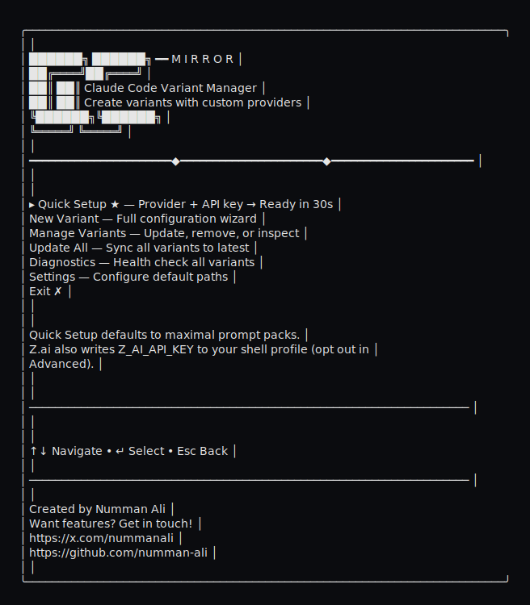

# cc-mirror

Build multiple isolated Claude Code variants with a full-screen TUI.

## Why this exists
- Keep your main `claude` install untouched.
- Create **unlimited** provider variants (`zai`, `minimax`, `openrouter`, `local`, etc.).
- Each variant has its **own** config + session store.
- One command to **update all** binaries after Claude Code upgrades.

## Quick Start (TUI)

```bash
npm run tui
# or (after bundle)
node dist/cc-mirror.mjs --tui
```

You’ll get a full-screen wizard with:
- **Quick setup** (provider + API key, npm install, done)
- **Advanced setup** (full control)
- manage / update / remove

## Quick Start (CLI)

```bash
# quick mode (npm install)
npm run dev -- quick --provider zai --api-key "$ZAI_API_KEY"
npm run dev -- quick --provider minimax --api-key "$MINIMAX_API_KEY"
npm run dev -- quick --provider openrouter --api-key "$OPENROUTER_API_KEY" --model-sonnet "anthropic/claude-3.5-sonnet" --model-opus "anthropic/claude-3-opus" --model-haiku "anthropic/claude-3-haiku"

# advanced mode
npm run dev -- create --provider zai --name zai --api-key "$ZAI_API_KEY"
npm run dev -- create --provider minimax --name minimax --api-key "$MINIMAX_API_KEY"
npm run dev -- list
npm run dev -- update
```

Quick mode defaults to the **maximal** prompt pack for Z.ai/MiniMax and, for Z.ai, writes `Z_AI_API_KEY` to your shell profile automatically (opt out with `--prompt-pack-mode minimal` or `--no-shell-env`).

## Paths & Isolation

Default root: `~/.cc-mirror`

Each variant gets its own sandbox:



```
  .-=-=-=-=-=-=-=-=-=-=-=-=-=-=-=-=-=-=-=-.
  |         ~/.cc-mirror/<variant>         |
  '-=-=-=-=-=-=-=-=-=-=-=-=-=-=-=-=-=-=-=-'
   |-- npm/              # npm install root (cli.js lives here)
   |-- config/           # CLAUDE_CONFIG_DIR (sessions + settings)
   |   |-- settings.json # env overrides (API keys, base URL, etc)
   |   '-- .claude.json  # API-key approvals + MCP server seeds
   |-- tweakcc/          # tweakcc config + backups
   |   |-- config.json   # brand preset + theme config
   |   '-- system-prompts/ # prompt fragment overlays (prompt packs)
   '-- variant.json      # metadata (provider, paths)

  wrapper -> ~/.local/bin/<variant> (configurable)
```

Wrappers are installed into `~/.local/bin/<variant>` (configurable).

Want color + extra flair? Render a colorized tree in your terminal:
```bash
printf "\033[38;5;220m.-=-=-=-=-=-=-=-=-=-=-=-=-=-=-=-=-=-=-=-.\033[0m\n"
printf "\033[38;5;220m|         ~/.cc-mirror/<variant>         |\033[0m\n"
printf "\033[38;5;220m'-=-=-=-=-=-=-=-=-=-=-=-=-=-=-=-=-=-=-=-'\033[0m\n"
printf "\033[38;5;244m |-- \033[38;5;81mnpm/\033[0m\n"
printf "\033[38;5;244m |-- \033[38;5;81mconfig/\033[0m\n"
printf "\033[38;5;244m |   |-- \033[38;5;150msettings.json\033[0m\n"
printf "\033[38;5;244m |   '-- \033[38;5;150m.claude.json\033[0m\n"
printf "\033[38;5;244m |-- \033[38;5;81mtweakcc/\033[0m\n"
printf "\033[38;5;244m |   |-- \033[38;5;150mconfig.json\033[0m\n"
printf "\033[38;5;244m |   '-- \033[38;5;150msystem-prompts/\033[0m\n"
printf "\033[38;5;244m '-- \033[38;5;150mvariant.json\033[0m\n"
printf "\033[38;5;244m wrapper -> \033[38;5;117m~/.local/bin/<variant>\033[0m\n"
```

## Provider Templates (built-in)
- Zai Cloud
- MiniMax Cloud
- OpenRouter (requires model mapping)
- Local LLMs (Anthropic-compatible, requires model mapping)
- Custom

You can add arbitrary env overrides during setup.

## Updating after Claude Code upgrades

```bash
npm run dev -- update
```

This re-runs `npm install` for the pinned package/version and re-applies tweakcc for all variants.

## Maintenance (common updates)

Update a single variant:
```bash
npm run dev -- update zai
```

Rebrand an existing variant:
```bash
npm run dev -- update zai --brand zai
```

Update API keys or base URL:
```bash
# Edit config directly
open ~/.cc-mirror/zai/config/settings.json
```

Remove a variant:
```bash
npm run dev -- remove zai
```

## Install (npm-only)
cc-mirror always installs `@anthropic-ai/claude-code@2.0.76` into `~/.cc-mirror/<variant>/npm` and runs its `cli.js`.
Use `--npm-package` to override the package name; the version stays pinned.

## Project `.claude` settings
Project-local settings (`.claude/settings.json`, `.claude/settings.local.json`) are still used by Claude Code.
`CLAUDE_CONFIG_DIR` only changes the **global/session storage location**, not project-local config discovery.

Z.ai note: when you provide a Z.ai API key, cc-mirror also sets `Z_AI_API_KEY` (for `zai-cli`) to the same value by default. Override with `--env Z_AI_API_KEY=...` if needed. Quick/TUI flows can also write it into your shell profile; if `Z_AI_API_KEY` is already set in your environment or shell profile, cc-mirror will detect it and skip writing. Opt out with `--no-shell-env`.

## CLI Options

```
cc-mirror create [options]
cc-mirror quick [options]
cc-mirror list
cc-mirror update [name]
cc-mirror remove <name>
cc-mirror doctor
cc-mirror tweak <name>

--name <name>            Variant name
--provider <name>        Provider: zai | minimax | openrouter | local | custom
--base-url <url>         ANTHROPIC_BASE_URL override
--api-key <key>          Provider API key (apiKey or authToken)
--timeout-ms <ms>        API_TIMEOUT_MS override
--env KEY=VALUE          Additional env (repeatable)
--model-sonnet <name>    ANTHROPIC_DEFAULT_SONNET_MODEL
--model-opus <name>      ANTHROPIC_DEFAULT_OPUS_MODEL
--model-haiku <name>     ANTHROPIC_DEFAULT_HAIKU_MODEL
--model-small-fast <name> ANTHROPIC_SMALL_FAST_MODEL
--model-default <name>   ANTHROPIC_MODEL
--model-subagent <name>  CLAUDE_CODE_SUBAGENT_MODEL
--brand <preset>         Brand preset: auto | none | zai | minimax | openrouter | local
--quick                 Fast path: provider + API key only (npm install)
--root <path>            Variants root (default: ~/.cc-mirror)
--bin-dir <path>         Wrapper install dir (default: ~/.local/bin)
--npm-package <name>     NPM package for npm installs (version pinned to 2.0.76)
--no-tweak               Skip tweakcc patching
--no-prompt-pack         Skip provider prompt pack (default: on for zai/minimax)
--prompt-pack-mode <m>   Prompt pack mode: minimal | maximal (default: maximal for zai/minimax)
--no-skill-install       Skip dev-browser skill install (default: on for zai/minimax)
--skill-update           Force-update dev-browser skill if already present
--shell-env              Write provider env vars into shell profile (Z.ai only)
--no-shell-env           Skip shell profile updates
--env CC_MIRROR_SPLASH=0 Disable the startup splash banner
--yes                    Non-interactive, accept defaults
--tui                    Force TUI
--no-tui                 Disable TUI
```

## Brand presets (tweakcc)
Brand presets are optional, tweakcc-powered UI skins. `auto` picks a preset that matches your provider (if one exists).

Available presets:
- `zai` — Z.ai Carbon (dark carbon palette + gold/blue accents, Z.ai toolset label)
- `minimax` — MiniMax Pulse (vibrant spectrum accents, MiniMax toolset label)
- `openrouter` — OpenRouter Slate (light slate + deep blue accents, OpenRouter toolset label)
- `local` — Local LLMs Sky (sky blue accents, Local toolset label)

Use it in CLI:
```bash
npm run dev -- create --provider zai --name zai --brand zai --api-key "$ZAI_API_KEY"
npm run dev -- create --provider minimax --name minimax --brand minimax --api-key "$MINIMAX_API_KEY"
npm run dev -- create --provider openrouter --name openrouter --brand openrouter --api-key "$OPENROUTER_API_KEY"
npm run dev -- create --provider local --name local --brand local --api-key ""
```

Or from the TUI, pick the preset after selecting a provider.

## tweakcc UI per variant
Want to tweak themes/tools directly? Launch tweakcc bound to a specific variant:

```bash
npm run dev -- tweak zai
```

This opens tweakcc with:
- `TWEAKCC_CONFIG_DIR=~/.cc-mirror/zai/tweakcc`
- `TWEAKCC_CC_INSTALLATION_PATH=~/.cc-mirror/zai/npm/node_modules/@anthropic-ai/claude-code/cli.js`

## Legacy shell script (two variants)
There is still a minimal, non-interactive script for just z.ai + MiniMax:

```bash
./scripts/build-claude-variants.sh
```

If `./node_modules/.bin/tweakcc` is present, the script uses it; otherwise it falls back to `tweakcc` or `npx tweakcc@3.2.2`.

Note: the legacy script does not apply brand presets. For the Z.ai skin, use the CLI/TUI with `--brand zai`.

Script env overrides:
```
CLAUDE_ORIG
CLAUDE_VARIANTS_ROOT
CLAUDE_VARIANTS_BIN_DIR
ZAI_BASE_URL
MINIMAX_BASE_URL
ZAI_API_TIMEOUT_MS
MINIMAX_API_TIMEOUT_MS
ZAI_API_KEY
MINIMAX_API_KEY
```

## Publishing for `npx cc-mirror`
If you want `npx cc-mirror`, publish this package to npm (set `"private": false`). The `prepack` script bundles:

```
npm run bundle
npm publish
```

## z.ai Plugins (optional)
```bash
zai plugin marketplace add zai-org/zai-coding-plugins
zai plugin install glm-plan-usage@zai-coding-plugins
zai plugin install glm-plan-bug@zai-coding-plugins
```

## Notes
- You can override defaults anytime with env flags in the TUI or CLI.
- The session store is **not** in `~/.claude` unless you set `--root` that way.
- For OpenRouter/Local templates, confirm the base URL and model mapping in the wizard before creating.
- OpenRouter uses `ANTHROPIC_AUTH_TOKEN` with `ANTHROPIC_BASE_URL=https://openrouter.ai/api`.
- Local LLMs accept a blank key; cc-mirror will set a placeholder auth token (`local-llm`) so Claude Code starts cleanly.
- cc-mirror writes `ANTHROPIC_API_KEY` so Claude Code can detect API-key auth during onboarding (API-key providers only).
- cc-mirror pre-approves the API key by writing its last 20 chars into `~/.cc-mirror/<variant>/config/.claude.json` (`customApiKeyResponses.approved`) to skip the OAuth login screen.
- Wrappers load `settings.json` env vars at runtime, so onboarding sees API keys before Claude Code applies config env internally.
- Brand preset config lives in `~/.cc-mirror/<variant>/tweakcc/config.json`.
- Brand presets stamp the user label in the chat banner from `CLAUDE_CODE_USER_LABEL` (or your OS username).
- Provider prompt packs (Z.ai/MiniMax) are enabled by default; opt out with `--no-prompt-pack`.
- dev-browser skill is installed by default for Z.ai/MiniMax into `~/.cc-mirror/<variant>/config/skills/dev-browser` (opt out with `--no-skill-install`).
- MiniMax variants also add a default `MiniMax` MCP server entry in `~/.cc-mirror/<variant>/config/.claude.json` (uvx `minimax-coding-plan-mcp`), ready for you to paste your API key.
- Z.ai variants deny the known server-side MCP tools by name in `~/.cc-mirror/<variant>/config/settings.json` so the model prefers `zai-cli`.
- cc-mirror strips `ANTHROPIC_AUTH_TOKEN` for API-key variants to avoid auth conflicts. Auth-token variants keep it.

## Docs
- tweakcc integration + implementation ideas: `docs/TWEAKCC-GUIDE.md`
